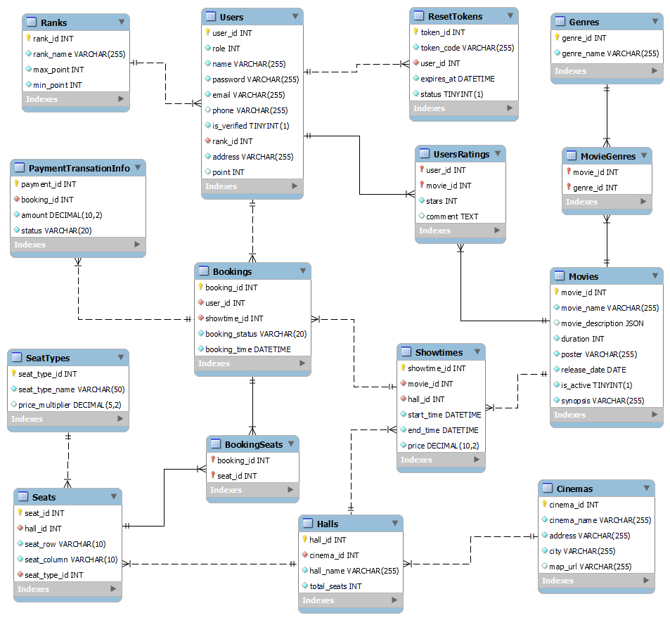
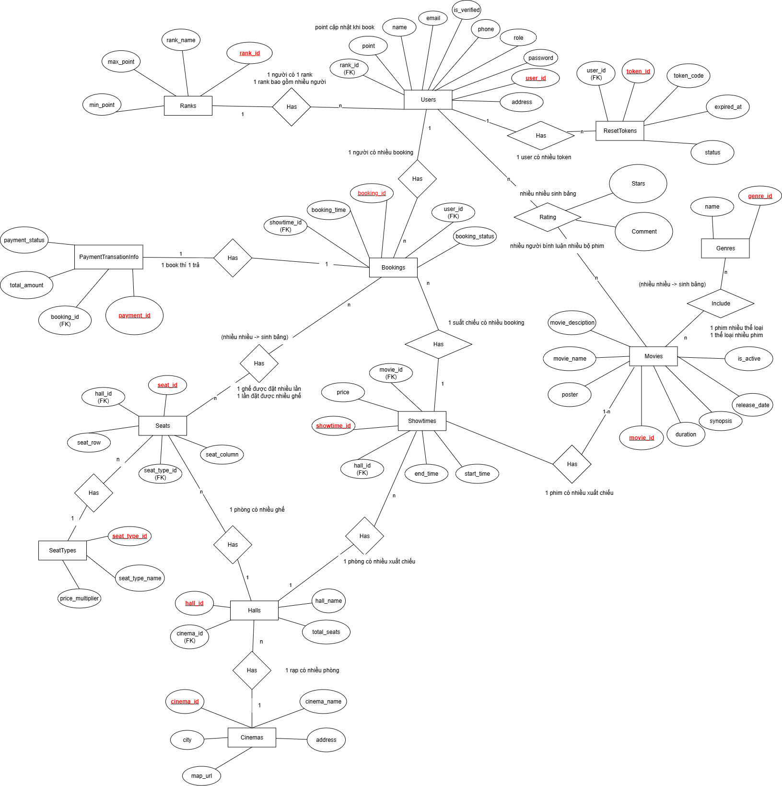

## 🛠️ Lược đồ quan hệ (Relational Schema)

> Lược đồ thực tế sinh ra từ MySQL Workbench, thể hiện bảng, khóa chính – khóa ngoại, dùng để triển khai cơ sở dữ liệu.

---

## 💡 Lược đồ ER gốc (ER Diagram - Conceptual)

> Sơ đồ ER truyền thống, với thực thể (ô chữ nhật), thuộc tính (hình tròn), và quan hệ (hình thoi).

